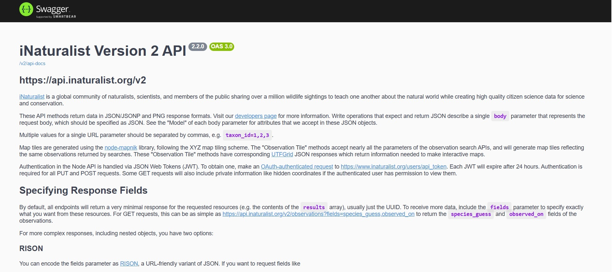
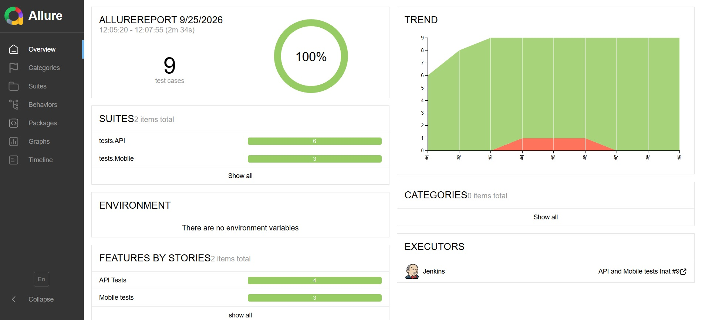
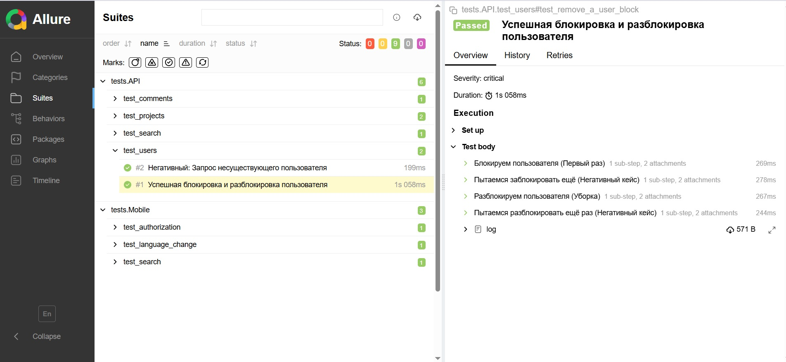
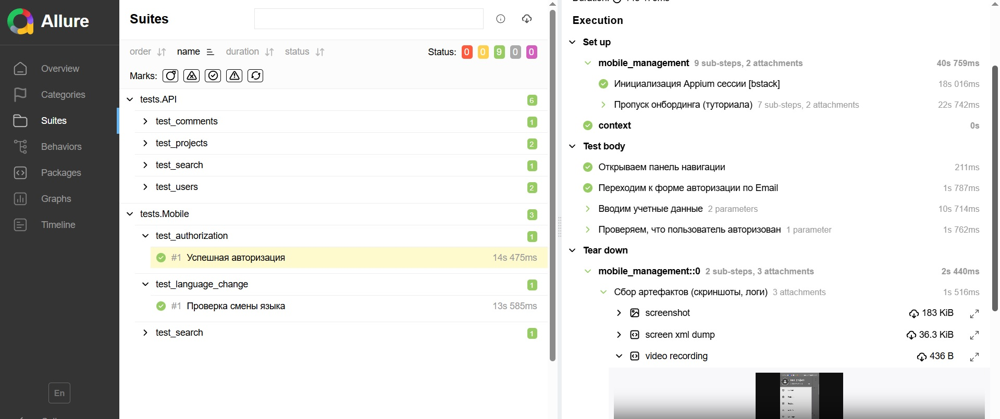
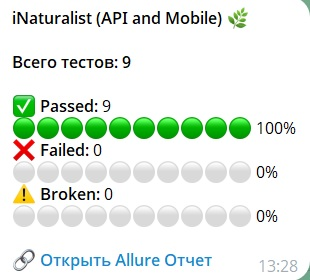

# Проект по автоматизации тестирования API и мобильного приложения проекта Inaturalist.org

> <a target="_blank" href="https://www.inaturalist.org//">Ссылка на сайт</a>

----
### Проект реализован с использованием:
 
 
 
 
 
 


----
 ### Особенности проекта
* Оповещения о тестовых прогонах в Telegram
* Отчеты с видео, скриншотом, логами, исходной моделью разметки страницы
* Сборка проекта в Jenkins
* Отчеты Allure Report
* Запуск мобильных автотестов в Browserstack

> Платформа iNaturalist — это глобальная научная база данных о биоразнообразии Земли. Любая некорректная, сгенерированная или тестовая запись засоряет систему и напрямую вредит реальным научным исследованиям, искажая статистику видов.
**Тестирование функционала проводилось исключительно в строгом соответствии с правилами и рекомендациями сообщества iNaturalist.**
Все запросы отправлялись в тестовом режиме, без создания фейковых наблюдений в публичном пространстве.
Все тестовые данные, артефакты и временные записи были полностью очищены и удалены.
___
> Реализован двухэтапный процесс аутентификации (OAuth2 Password Credentials -> обмен на JWT-токен) в строгом соответствии с рекомендациями iNaturalist API. Интегрирован кастомный User-Agent и ограничение частоты запросов (Rate Throttling) для предотвращения блокировок со стороны API
----

> 📡**Bypass сетевых блокировок (Telegram):** Из-за блокировок API Telegram на стороне провайдера сервера, разработан собственный reverse-proxy на базе Cloudflare Workers. Реализован принудительный DNS-резолвинг (--resolve) в bash-скриптах Jenkins для гарантированной доставки отчетов.
___

----
 ### Список проверок, реализованных в API автотестах

- [x] Запрос на создание комментария к наблюдению
- [x] Запрос на проверку списка участников проекта
- [x] Поисковый запрос вида
- [x] Запрос на блокировку и разблокировку пользователя
- [x] Запрос несуществующего пользователя

____

 ### Список проверок, реализованных в mobile автотестах

- [x] Успешная авторизация
- [x] Проверка смены языка
- [x] Поиск объекта и проверка его отображения в результатах поиска

____

### Локальный запуск

> Для локального запуска с дефолтными значениями необходимо выполнить команду:

```
python -m venv .venv
source .venv/bin/activate
pip install -r requirements.txt
```

> Перед запуском в корне проекта нужно создать файл `.env` с доступами к iNaturalist и OAuth-приложению
> (в git не коммитится):

```
INAT_USERNAME=...
INAT_PASSWORD=...
INAT_APP_ID=...
INAT_APP_SECRET=...
```

**Запуск API-тестов**

```
pytest tests/API
```

**Запуск мобильных тестов**

Мобильным тестам нужен запущенный Appium-сервер и эмулятор или подключённое устройство:

```
npm install -g appium
appium driver install uiautomator2
appium
```

```
pytest tests/Mobile --context emulator   # эмулятор
pytest tests/Mobile --context real       # реальное устройство
pytest tests/Mobile --context bstack     # BrowserStack
```

Окружение задаётся параметром `--context` (по умолчанию `emulator`):

| Значение | Где запускается | Что нужно |
|---|---|---|
| `emulator` | локальный Android-эмулятор | Appium, имя эмулятора в `MY_EMULATOR_NAME` |
| `real` | подключённый телефон | Appium, udid из `adb devices` в `MY_LOCAL_UDID` |
| `bstack` | облако BrowserStack | `BS_USER`, `BS_KEY`, `BS_APP_ID` в `.env` |

**Allure-отчёт локально**

```
pytest tests/API --alluredir=allure-results
allure serve allure-results
```

----

### Удаленный запуск автотестов выполняется на сервере Jenkins

> CI развёрнут на собственном сервере. Доступ к Jenkins — по логину и паролю:
> ссылка и гостевой доступ предоставляются по запросу.

#### Для запуска автотестов в Jenkins

1. Открыть проект в Jenkins (доступ по логину и паролю)
2. Нажать кнопку `Build with parameters`
3. Выбрать тесты для запуска
4. Результат запуска сборки можно посмотреть в отчёте Allure в интерфейсе сборки

#### Параметры сборки

> > `tests` – запускает все тесты проекта: api и mobile.
>
> > `tests/API` – запускает только api тесты.
>
> > `tests/Mobile` – запускает только mobile тесты.

> > `context` – окружение для мобильных тестов: `emulator`, `real`, `bstack`.

### Allure отчет

#### Общие результаты


#### Список тест кейсов в Allure 


#### Пример тест кейса в Allure с логированием и attachments


#### Нотификация в Telegram


#### Видео прохождения теста Mobile


